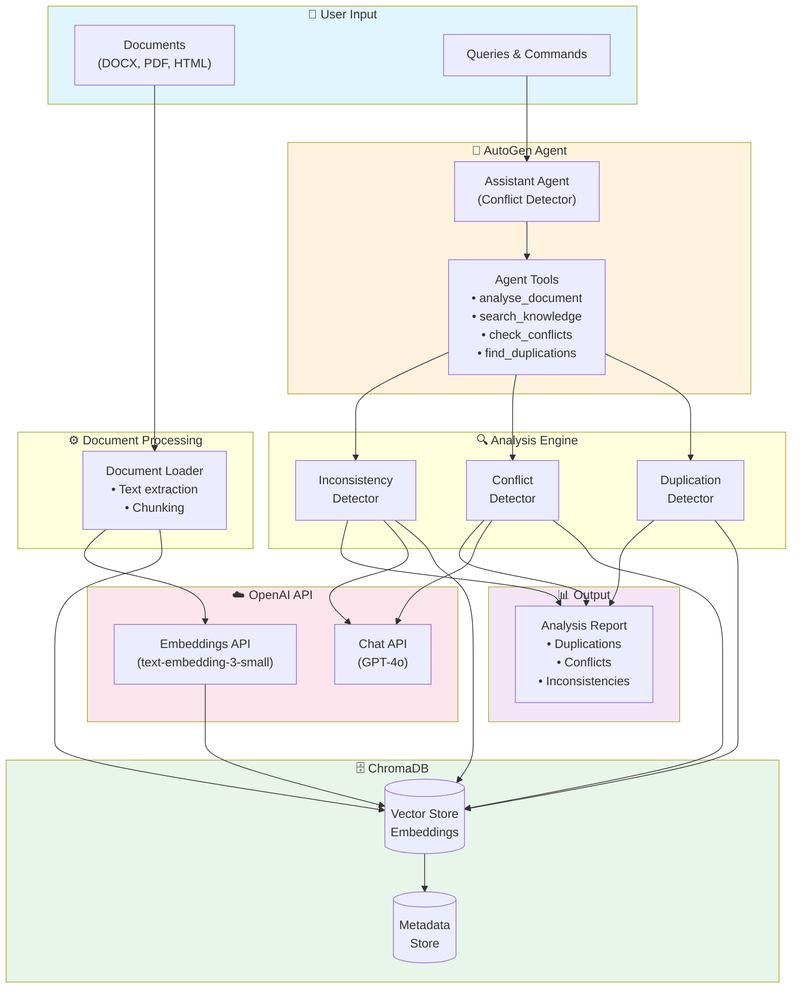
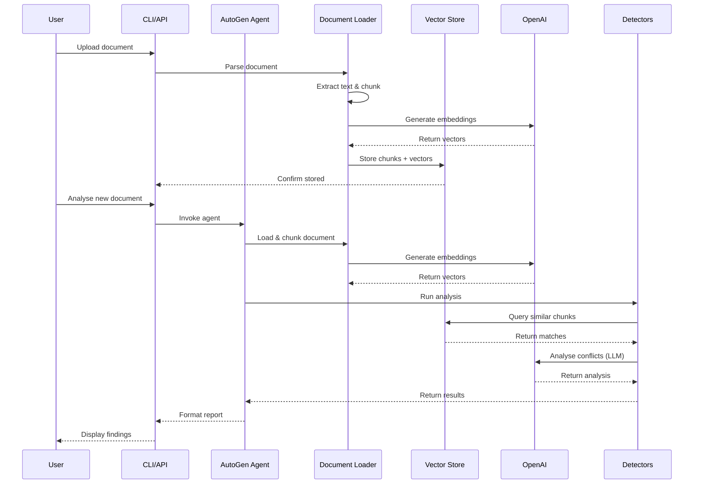

# Conflict and Duplication Detection Agent

An intelligent document analysis agent built with Microsoft AutoGen and OpenAI that detects conflicts, duplications, and inconsistencies across document collections. Uses ChromaDB for semantic search and vector storage.

## Features

- **Document Processing**: Supports DOCX, PDF, and HTML formats
- **Duplication Detection**: Finds semantically/thematically similar content across documents
- **Conflict Detection**: Identifies contradictions, numerical discrepancies, procedural conflicts, and policy conflicts
- **Inconsistency Detection**: Detects terminology, formatting, tone, and versioning inconsistencies
- **Knowledge Base**: Persistent vector storage with ChromaDB
- **Interactive Agent**: Chat interface powered by Microsoft AutoGen
- **CLI Interface**: Full command-line interface for batch processing

## Installation

### Prerequisites

- Python 3.10 or later
- OpenAI API key

### Setup

1. Clone the repository:

```bash
git clone https://github.com/yourusername/conflict-duplication-detector.git
cd conflict-duplication-detector
```

2. Create a virtual environment:

```bash
python -m venv venv
source venv/bin/activate  # On Windows: venv\Scripts\activate
```

3. Install dependencies:

```bash
pip install -r requirements.txt
```

4. Configure environment variables:

```bash
cp .env.example .env
# Edit .env and add your OpenAI API key
```

## Usage

### CLI Commands

#### Analyse a Document

Analyse a document for conflicts, duplications, and inconsistencies against the knowledge base:

```bash
python -m src.main analyse path/to/document.pdf
python -m src.main analyse path/to/document.docx --json  # Output as JSON
```

#### Add Documents to Knowledge Base

```bash
# Add a single document
python -m src.main add path/to/document.pdf

# Add all documents from a directory
python -m src.main add path/to/documents/
```

#### Search the Knowledge Base

```bash
python -m src.main search "access control policy" --results 10
```

#### Find All Duplications

```bash
python -m src.main duplications
python -m src.main duplications --within  # Include within-document duplications
```

#### Check Conflicts on a Topic

```bash
python -m src.main conflicts "password requirements"
```

#### Interactive Chat Mode

```bash
python -m src.main chat
```

#### View Knowledge Base Info

```bash
python -m src.main info
```

#### Clear Knowledge Base

```bash
python -m src.main clear --force
```

### Python API

```python
import asyncio
from src.agents.conflict_detector_agent import ConflictDetectorAgent

# Initialize the agent
agent = ConflictDetectorAgent(
    persist_directory="./chroma_db",
    collection_name="my_knowledge_base",
)

# Add documents to knowledge base
result = agent.add_knowledge_directory("./documents")
print(f"Added {result['chunks_added']} chunks")

# Analyse a document
analysis = agent.analyse_document_sync("./new_document.pdf")
print(f"Found {len(analysis.duplications)} duplications")
print(f"Found {len(analysis.conflicts)} conflicts")
print(f"Found {len(analysis.inconsistencies)} inconsistencies")

# Search the knowledge base
results = agent.vector_store.search("security policy", n_results=5)
for r in results:
    print(f"{r.similarity_score:.2%}: {r.content[:100]}...")

# Interactive chat with the agent
async def chat():
    response = await agent.chat("What conflicts exist in the security documentation?")
    print(response)

asyncio.run(chat())
```

## Architecture

### System Flow Diagram



### Data Flow



### Project Structure

```
conflict-duplication-detector/
├── src/
│   ├── agents/
│   │   └── conflict_detector_agent.py  # AutoGen agent implementation
│   ├── knowledge/
│   │   ├── document_loader.py          # DOCX, PDF, HTML parsing
│   │   └── vector_store.py             # ChromaDB integration
│   ├── analysis/
│   │   ├── duplication_detector.py     # Semantic duplication detection
│   │   ├── conflict_detector.py        # LLM-powered conflict detection
│   │   └── inconsistency_detector.py   # Inconsistency analysis
│   ├── utils/
│   │   └── text_utils.py               # Text processing utilities
│   └── main.py                         # CLI entry point
├── requirements.txt
├── .env.example
└── README.md
```

## Configuration

Environment variables (`.env`):

| Variable | Description | Default |
|----------|-------------|---------|
| `OPENAI_API_KEY` | Your OpenAI API key | Required |
| `OPENAI_EMBEDDING_MODEL` | Embedding model to use | `text-embedding-3-small` |
| `OPENAI_CHAT_MODEL` | Chat model for analysis | `gpt-4o` |
| `CHROMA_PERSIST_DIRECTORY` | ChromaDB storage location | `./chroma_db` |
| `CHROMA_COLLECTION_NAME` | Default collection name | `knowledge_base` |
| `SIMILARITY_THRESHOLD` | Threshold for duplication detection | `0.85` |
| `CONFLICT_CONFIDENCE_THRESHOLD` | Minimum confidence for conflicts | `0.7` |

## Detection Types

### Duplications

- **Exact**: Near-identical content (>98% similarity)
- **Near Duplicate**: Very similar content (90-98% similarity)
- **Thematic**: Semantically related content (80-90% similarity)

### Conflicts

- **Contradiction**: Opposite statements about the same topic
- **Numerical**: Different numbers, dates, or percentages
- **Procedural**: Different steps or sequences for the same process
- **Policy**: Different rules or requirements
- **Definitional**: Different definitions for the same term

### Inconsistencies

- **Terminology**: Different terms for the same concept
- **Format**: Inconsistent formatting or structure
- **Tone**: Inconsistent voice or formality level
- **Versioning**: Mix of outdated and current information
- **Scope**: Overlapping but inconsistent scopes
- **Reference**: Broken or inconsistent cross-references

## License

MIT License - see [LICENSE](LICENSE) for details.
